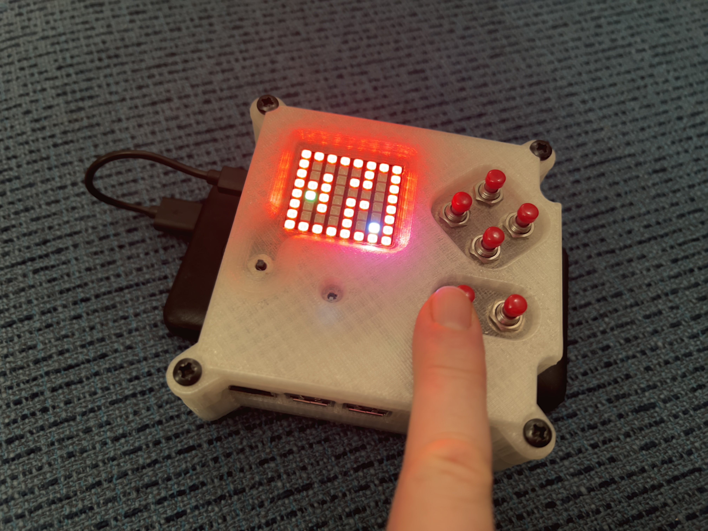

# Astro Pi Demonstration

A collection of python programs to help students with the [Astro Pi Mission Zero challenge](https://astro-pi.org/mission-zero/).

Put the files from this repository into a directory called `/home/pi/astro-pi-sensors`

Set up the system service in `astro_pi_demo.service` (see instructions in that file) to get a couple of demos
running automatically when the Pi starts.

There are two programs you can switch between by pressing each of the bottom pair of buttons -- one gives you a maze controlled by motion, the other shows two graphs: for humidity and temperature -- breathe on the sensor to see the effect!

### Marble Maze (button A)

### Temp/Humidity bar graph (button B)

